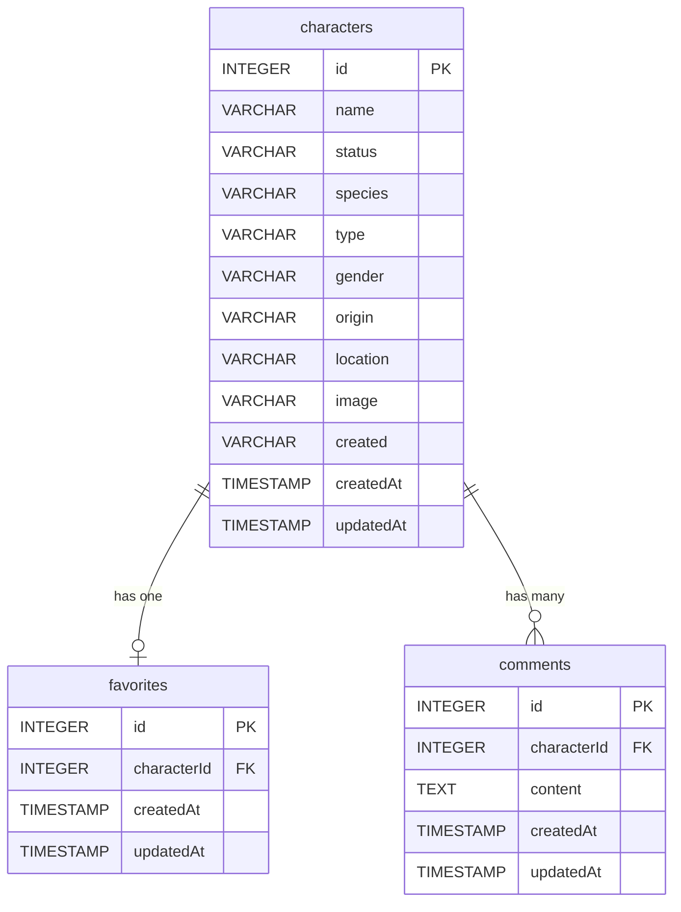

# Entity Relationship Diagram

```mermaid
erDiagram
    characters {
        INTEGER id PK
        VARCHAR name
        VARCHAR status
        VARCHAR species
        VARCHAR type
        VARCHAR gender
        VARCHAR origin
        VARCHAR location
        VARCHAR image
        VARCHAR created
        TIMESTAMP createdAt
        TIMESTAMP updatedAt
    }

    favorites {
        INTEGER id PK
        INTEGER characterId FK
        TIMESTAMP createdAt
        TIMESTAMP updatedAt
    }

    comments {
        INTEGER id PK
        INTEGER characterId FK
        TEXT content
        TIMESTAMP createdAt
        TIMESTAMP updatedAt
    }

    characters ||--o| favorites : "has one"
    characters ||--o{ comments : "has many"
```
